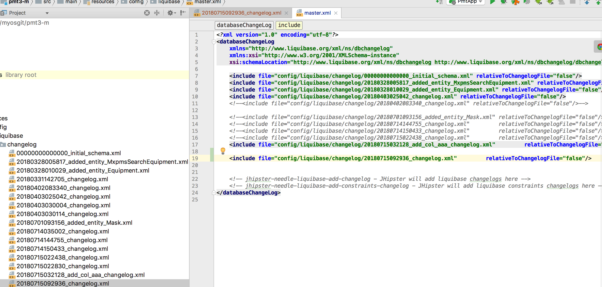
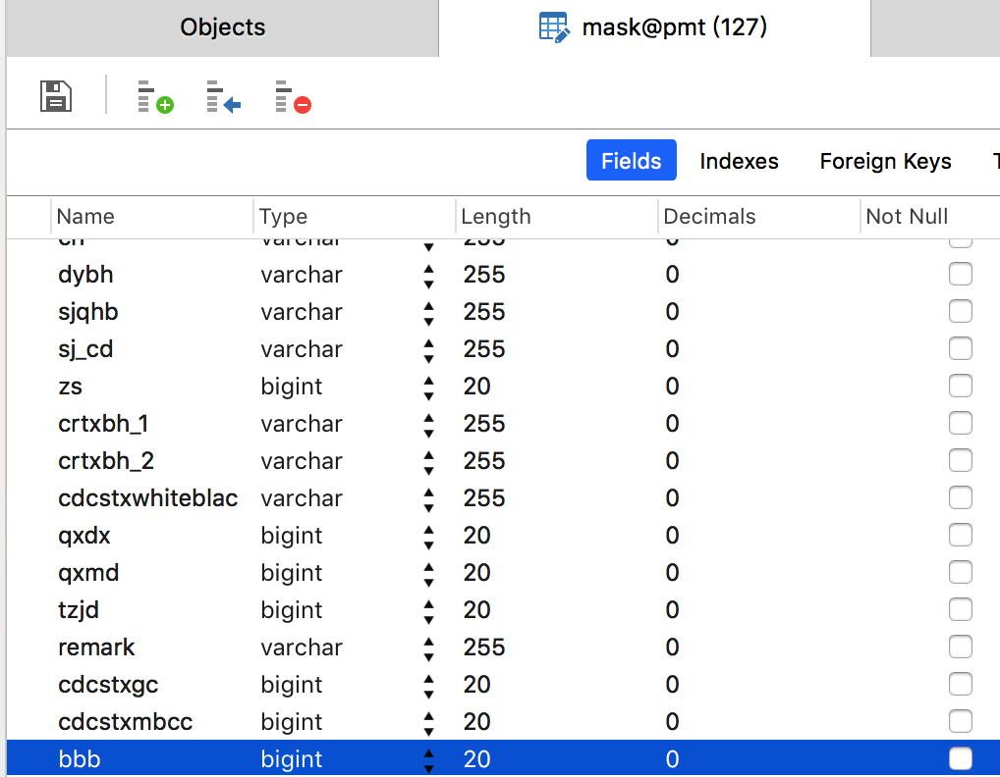

## 实体修改字段

### 1 修改字段为 bbb

### 2 重新生成实体之后用 diff 生成变化日志文件

    jhipster import-jdl src/main/resources/dsl/mask.jh
    mvn liquibase:diff

[jh操作50秒视频](https://asciinema.org/a/1iN4a4wTYQPEOE3m7zMIdG82p)

### 3 手动将日志文件名加入master.xml中

### 4 重启后台查看表字段已经修改

